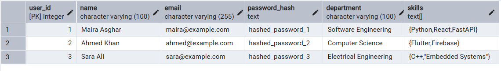
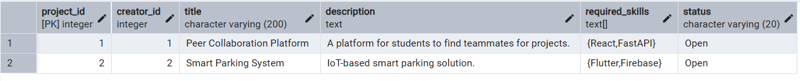
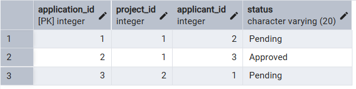
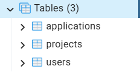

# Phase 1 - Database Schema Design

## Project Title
**Peer Project Collaboration Platform**

## Overview

The Peer Project Collaboration Platform is designed to help students across different engineering and computing disciplines find teammates for their projects. Students can showcase their ongoing projects, specify the skills they require, and allow other students to apply for collaboration.

This phase focuses on designing the relational database schema that will support the platform.

---

## Objectives

- Design the database structure for the platform.
- Create normalized relational tables.
- Establish relationships using primary and foreign keys.
- Apply appropriate constraints to maintain data integrity.

---

## Technologies Used

- PostgreSQL
- SQL
- pgAdmin 4
- Git
- GitHub
- draw.io (ER Diagram)

---

## Database Tables

### Users

Stores information about registered students.

| Column | Description |
|---------|-------------|
| user_id | Unique identifier for each user |
| name | Student's full name |
| email | Unique email address |
| password_hash | Encrypted password |
| department | Student's department |
| skills | Array of technical skills |

---

### Projects

Stores project information created by users.

| Column | Description |
|---------|-------------|
| project_id | Unique project ID |
| creator_id | References the user who created the project |
| title | Project title |
| description | Project description |
| required_skills | Skills required for the project |
| status | Open or Closed |

---

### Applications

Stores project applications submitted by users.

| Column | Description |
|---------|-------------|
| application_id | Unique application ID |
| project_id | References the project |
| applicant_id | References the applicant |
| status | Pending, Approved or Rejected |

---

## Relationships

- One user can create multiple projects.
- One project can receive multiple applications.
- One user can submit multiple applications.

---

## Constraints Used

- PRIMARY KEY
- FOREIGN KEY
- NOT NULL
- UNIQUE
- CHECK

---

## Folder Structure

```
Phase-1
│
├── db_setup.sql
├── README.md
├── models
└── Output
```

---

## Output

Execution screenshots are available inside the **Output** folder.

The Entity Relationship Diagram (ERD) is available inside the **models** folder.
---

## Entity Relationship Diagram

The database schema is illustrated below.


---

## Output Screenshots

### Users Table



### Projects Table



### Applications Table



### Tables Created

