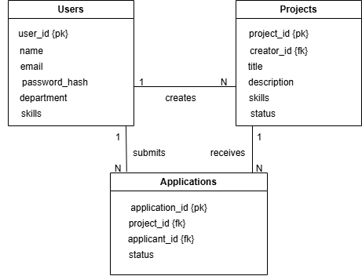

# Entity Relationship Diagram (ERD)

This folder contains the Entity Relationship Diagram (ERD) for the **Peer Project Collaboration Platform** database.

## Overview

The ERD illustrates the relationships between the three core entities:

- **Users**
- **Projects**
- **Applications**

## Relationships

- One user can create multiple projects.
- One project can receive multiple applications.
- One user can submit multiple applications.

## Diagram

